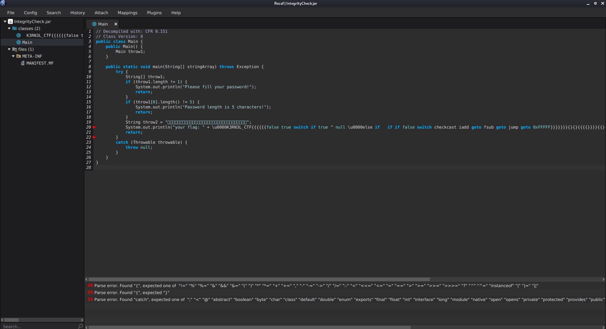
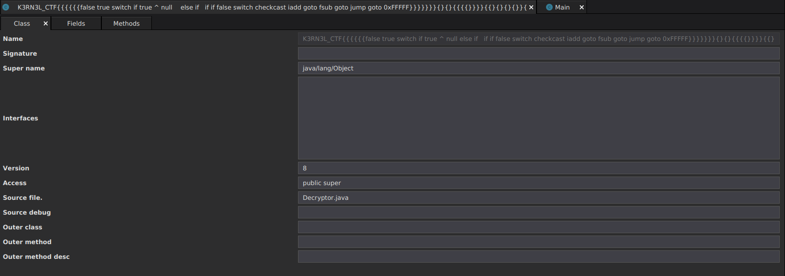
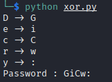

# Integrity Checker
### Task source:
https://github.com/Tzion0/CTF/tree/master/K3RN3LCTF

Load the .jar file into Java bytecode editor, Recaf. We can see it pop out some error (We will deal with it later). Looking at this source code, we know that password length is 5 and it will call the function start with `\u0000K3RN3L_CTF{{{{{{` with password as argument.  


Apparently the calling function was the cause of error. Let's view its original class:
```
Right click class tab -> Class Mode -> Table
```
We can see the `Source file.` is `Decryptor.java` indicate its original class name was `Decryptor`


After knowing the original class name, we can rename it. 
```
On left side, right click class name -> Rename to Decryptor
```

After that, we can take a look on `Decryptor` class. Apparently it is taking the class name `Decryptor` to convert to array then taking its first 5 characters, `throw9[0], throw9[1], throw9[2], throw9[3], throw9[4]` to XOR with specific bytes, `3, 0xC, 0x20, 5, 0x43` and compare with our password.
```
String throw8 = throw6[0].getClassName();
char[] throw9 = throw8.toCharArray();

if ((char)(throw9[0] ^ 3) != throw10[0] && (char)(throw9[1] ^ 0xC) != throw10[1] && (char)(throw9[2] ^ 0x20) != throw10[2] && (char)(throw9[3] ^ 5) != throw10[3] && (char)(throw9[4] ^ 0x43) != throw10[4]) {
	System.out.println("Your password input is invalid!");
    return "INVALID PASSWORD!";
}
```

We can create a script to find then password:
```
#!/usr/bin/env python3

class_name = "Decryptor"
byte = [3, 0xC, 0x20, 5, 0x43]
xored = []

for i in range(5):
	xored.append(chr(ord(class_name[i]) ^ byte[i]))
	print(f"{class_name[i]} -> {xored[i]}")

print("Xored : " + "".join(xored))
```


Now we have found the password, go back to Recaf then click File -> Export program and save it as .jar file.
Execute it with the password as argument to retrieve the flag:
```
$ java -Xverify:none -jar IntegrityCheck_out.jar GiCW:                                                        1 ⨯
Picked up _JAVA_OPTIONS: -Dawt.useSystemAAFontSettings=on -Dswing.aatext=true
your flag: flag{H3LL0_YOU_KN0W_SOURC3_FIL3}
```

Special thanks to TheEasyPeasy assistance in this writeup. It won't be possible without him. Be sure to check out his writeup on solving this task using other tools with different ways:

https://github.com/TheEasyPeasy/CTF-writeups/blob/main/k3rn3l4rmy-CTF2021/Kiddie%20Pool/Integrity%20Checker/README.md